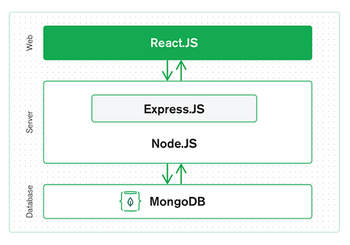

# **MERN-DOCKER STARTER KIT**

MERN is the acronym for MongoDB, Express JS, React JS and Node JS. It is a combination of the above technologies, all based on JavaScript, used to build advanced web applications. It is an open source full stack development framework i.e. it provides entire front-end to back-end development components.

* [MongoDB](https://www.mongodb.com) - Document-Based Database
* [Express](https://expressjs.com) - Web Application Framework for Node.js
* [React](https://reactjs.org) - Front-End JavaScript library
* [Node.js](https://nodejs.org) - Back-end JavaScript Runtime Environment 




# **Docker deployment and orchestration**

Docker enables developers to package applications into containers—standardized executable components that combine application source code with all the operating system (OS) libraries and dependencies required to run the code in any environment.

Docker Compose is a tool for defining and running multi-container Docker applications. With Compose, you use a YAML file to configure your application’s services. Then, with a single command, you create and start all the services from your configuration.

* [Docker](https://www.docker.com) - Toolkit for building, deploying, and managing containerized applications
* [Docker Compose](https://docs.docker.com/compose/) - Toolkit for orchestrating multi-container Docker applications  

## Installing Docker and Docker Compose
- [Install Docker](https://docs.docker.com/install/)
- [Install Docker Compose](https://docs.docker.com/compose/install/)

## Build and Start Application
1. Clone the repository
    ```shell script
    $ git clone https://github.com/600maan/mern-docker-starter-kit.git
    ```
2. Configure environment variables
- Copy `.env.example`  to  `.env`  in backend app and fill the variables
- Copy `.env.example`  to  `.env`  in frontend app and fill the variables
- Copy `.env.example`  to  `.env`  in root folder for docker-compose

3. Build and Start Containers with Docker Compose
    ```shell script
    $ docker-compose up -d --build
    ```
4. View application in browser 
[http://localhost:3000](http://localhost:3000)
